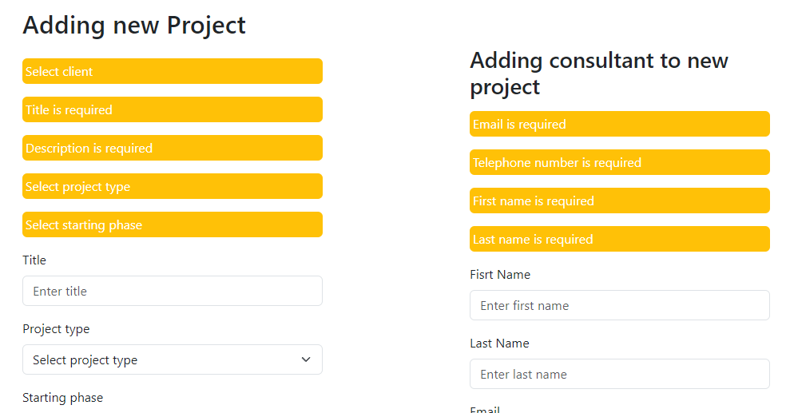
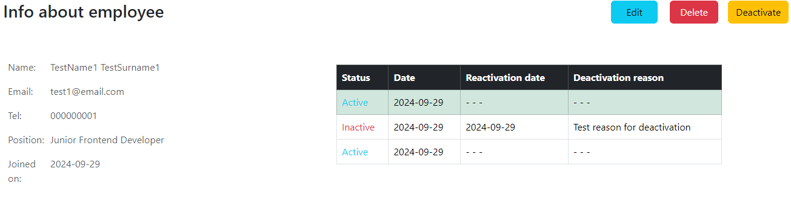

# HRAPP - Simple application for HR team

HRAPP was build using Spring Boot 3.3 , Spring MVC with Thymeleaf HTML, Bootstrap CSS and MySQL DB.

### Description
This simple web app is aimed at Hr team to abble a clear view of enterprise functioning. It is provided through insight of current projects, their principals, colsultants and employees which are working on them. It is also possible to contantly monitor employee's activities. HR team can deactivate employees on their time off and reactivate them by hand or wait till reactivation date comes. 


# Table of contents

 - [Database](#database)
 - [Adding items](#adding-items)
 - [Employees](#employees)
    - [Employee Activity](#employee-activity)
 - [Clients](#clients)
 - [Projects](#projects)
    - [Project assignment](#project-assignment)
 - [Tests](#tests)

## Database

Database was created in MySQL Workbench 8.0 C .


Individual tables contains:
- employee - for storing info about employees
- employee-activity - for storing actual and historical data about employee activity
- project - for storing info about projects
- project_consultant - storing info about project consultant
- project-phase - storing info about actual and historical phases
- clients - storing info about clients
- project-employees - join table for employees and projects. It is used to perform employee assignments.

Database is connected to Spring Projec via standard SQL connection with:
```
spring.datasource.url = jdbc:mysql://localhost:3306/hrapp
spring.datasource.username = bernacki
spring.datasource.password = bernacki
```
## Adding items

Most of the items are created in manage page of the app. There you can create new employee, project and client. On the other hand, consultant, phases and assignments are created directly in project page. 


I know, it looks poorly for now. 

Each item is added through DTO and has its own adding page. Each page is validated and protected from entering inaproper data. 
After any error appears, user is redirected to the adding page and specific error is shown.

<div style="display: flex;">
  
  
</div>

While addign a project you can add a consultant right away. Is is optional though. If you want to add consultant, you can check a specific checkbox. When the checkbox is checked, a form for addign consultant appears.

<div style="display: flex;">
  
  
</div>

This page is also validated both for project and for consultant.


## Employees
Employees in HRAPP are stored in form of list which contains all necesary informations about each one of them. Employees are listed by their activity status by default. List is paginated, can be searched and sorted by:
- Full name - which means that a name, surname or both of them can be entered;
- email;
- telephone number;
- seniority - for example Junior, Mid, Senior;
- position - for example backend dev, frontend dev;
- full position - for seniority and position combined.
For each option, diffrent input is shown. For example, for full name there are 2 text fields, and for seniority or position, a drop down list is shown.


Each employee has its own page on which contains info like first name, last name etc. current activity status with historical data and projects that employee is assigned to. You can enter employee info page by clicking on info icon from the list.


On that page you can delete and edit employee which uses the same form as for adding. You can also monitor and change employee activities which is shown in the next section

### Employee activity

Employee activity is basicly a system by which you can track if employee was active in ceratin time period, if he is active now and when he will be inactive. 
You can set a date in future when an employee will be for example on holidays. Employee can be deactivated in current date if he is for example sick and can't work. 


This form is toggled by **Deactivate** button. 

After deactivation, when current activity status is inactive, deactivate button is replaced by reactivate button. 
If reactivation date is set and has not arrived yet, after manualy reactivation the date from inactive status is set to the date of manual reactivation.
After reactivation date commes, schedule automaticly set new active status for employee.




## Clients
Client is essential in order to add new project becouse every project has be assigned to client. Clients has page on which there are listed, and each specific client has their own page where you can see info about it and projects that client has commisioned.


Each project consultant is practicly assigned to client company. After clicking in contact button, info about project consultant is shown. It is not presented here becouse well.. its nothing special and will be expanded soon.

## Projects

Projects are listed just like employees. Project page has also pagination, searching and sorting. Just like on the employee page, after diffrent searching option is selected, diffrent input appears.
You can sort projects by:
- title
- type - for example WEB_APP
- current phase


Each project has its own page on which you can check employees that are assigned to project, info about project consultant, project client, project phases and project itself.
You can assign employees, change phase and assign a consultant if its not added already.


Below the employee list there is a list of phases that project achieved. After checking a specific checkbox, a form of adding a phase is shown.


### Project assignment

Project assignment connects projects with employees. In such assignment, every employee has its own role in certain projects. One employee can be assigned to many projects and in each of them, he can has diffrent role.
Assigning employee to project is done on separate page. There you can sort and seach for specific employee and assign role to them.


Every currenty active employee will be marked by green color while inactive will be marked red. On top of the page a role for the user is selected and below there is a form for selecting only one employee. Assignment button is shown only if any employee and role are selected.

## Tests
Tests was performed using JUnit 5 and mockito.
Currently created tests was mainly focused on repository package to ensure that all connections and querry methods are correct. H2 database was used in tests in order to speed up the process. 
